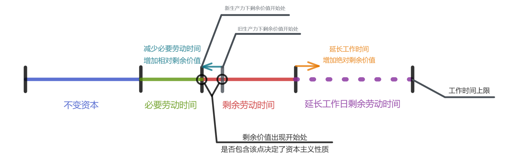

# 南开大学-政治经济学

[TOC]

## 第六章 资本的价值增殖过程


资本价值增殖是依靠生产活动实现的，生产领域的活动资本叫产业资本，只有产业资本才能生成剩余价值，其他如商业资本借贷资本的剩余价值都是这里来的；

资本主义生产目的不是向社会体提供所需商品，而是让资本价值得到增殖；

> 生产剩余价值或赚钱，是这个生产方式的绝对规律------马克思

商品则作为价值的载体，但生产价值是不够的，生产的价值必须大于投入价值，即生产出剩余价值

> 生产是为了赚钱而不得不做的倒霉事------马克思
>
> 资本有狂想病，企图不通过生产赚到钱------恩格斯

要是能够不生产赚到钱，资本一定会的，表现为资本投机，最后导致了经济危机；

资本主义生产是物质生产一般的形式；

### 第一节 资本主义生产过程 劳动过程和价值增殖过程的统一 资本的本质

资本借助劳动过程来实现价值增殖；

#### 一般劳动过程和资本主义劳动过程的区别

> 劳动先是人和自然之间的过程，是人以自身的活动来中介、调整和控制人和自然之间的物质变换的过程；------ 马克思

劳动过程包括 人类劳动，手段（资料）、对象，且劳动需要借助自然力；

生产资料（手段对象）在劳动的过程中变成了产品；劳动是主体，而生产资料是被劳动加工改造为产品；而不是劳动和生产资料一起创造的；

$ 生产资料 \rightarrow ^{劳动} \rightarrow产品 $

> 如粮食生产，需要太阳和雨水，为何主张按照贡献分配的人从来不主张给太阳和云分配工资呢？因为太阳没有主人，若真的有人能够控制阳光，那么他也会伸手向农场主们要分红，否则就不给予阳光；

劳动过程使得劳动对象向着适合人类需要的方向变化，他的结果是劳动产品；

资本主义生产是人类生产形式，也需要生产资料和劳动，但其劳动是雇佣关系下的过程，其特点为：

1 劳动者要在资本家的监督和支配下劳动，按照资本家的意志来劳动；

2 劳动产品归资本家所有；

资本家通过控制劳动来控制产品；但这两个特点还没有触及资本最本质特点；资本主义本质是剩余价值生产过程；

> 不仅生产使用价值，而且要生产商品，不仅要生产使用价值，而且要生产价值，不仅生产价值，而且要生产剩余价值------马克思

#### 商品的价值形成和资本价值增殖

具体劳动转移旧价值，抽象劳动创造新价值；

产品总价值 = 耗费的生产资料价值+新价值

资本主义来说，需要产出比投入多；

例：

```
假定，

1  纺纱工人6小时出产50公斤

2  棉花2元/公斤  总价 100元

3  机器消耗价值20元 总价20元

生产中生产资料总价值120元=棉花总价+机器损耗；是旧价值靠具体劳动来转移；

4  6小时抽象劳动新创造价值 30 元

生产结果：棉纱总价值 150

结果：6小时具体劳动，120生产资料变为产品，六小时抽象劳动，创造新价值30元，结果生产价值150元；
```

此时我们需要将劳动力价值因素加入；

资本价值要增殖，价值的形式过程必须持续一定长度，让劳动者抽象劳动创造的价值大于其自身劳动力价值；所谓资本的价值增殖过程，不外是时间延续超过一定点，即补偿劳动力价值所需的劳动时间点，而延长了价值形成过程；

```
再次假定
工人工作时间延长到了12小时每天，纺纱100公斤，消耗棉花100公斤，棉花2元/公斤，总价200，机器消耗40元
纱的生产资料总价240  =  棉花总价200+机器损耗40
假定12小时创造新价值  60元
那么棉纱总价值为300

假定纺纱工人的劳动力日价值30元
生产投入的资本价值240+30 = 270
剩余价值30 = 棉纱总价值300 - 生产投入的资本270

结果：新创造的价值中，30元支付劳动力价值，剩余30为剩余价值，就因为工人工作时长增加了，因此增加工人不必要的劳动时间，就是剩余价值的秘密，其占用了工人的剩余时间来为其继续的劳动生产，因此得名剩余价值；资本不满足于回本，而是增加这种生产关系的时长来获利；
```

资本家履行了一切商品条件，却在结果得到了额外的价值；

> 庸俗经济学家西尼尔维护资本家的谬论：利润是最后一小时生产的，每天必须工作这些时长，否则资本家没有利润了；

但其中隐藏了内容就是，工作时间短就可以减低生产资料的消耗，剩余的价值依旧存在；

可见剩余价值是工人在生产过程创造的价值超过劳动力价值的部分；

工人生产的价值分为两部分：

1 再生产自身劳动力价值的时间，这部分时间就是必要劳动时间，其中付出的劳动就是**必要劳动**；

2 超过必要劳动时间外的劳动时间，这部分时间叫做剩余劳动时间，其中付出的劳动叫**剩余劳动**；

> 剩余价值以无中生有的魅力吸引着资本家------马克思

工人生产中转移旧价值劳动C，必要劳动时间内的劳动力价值V，剩余劳动时间剩余价值M；

W = C+ V+M

V+M = 新创造价值；那么真正的争夺就在这里；资本家尽可能减小V增加M，而工人相反；

剩余价值由雇佣工人的剩余劳动创造，且被资本家无偿占有的部分；

剩余价值体现着资产阶级与其代表对工人剩余劳动的剥削关系；

用于购买劳动力和生产资料的货币在生产中得到增殖，所以这部分货币作为资本发挥作用；

可见资本不是物，本质是表现在物上的生产关系，资本体现着资产阶级凭借对生产条件和生活资料的占有，无偿占有工人剩余劳动的剥削关系；

附：

批判关于剩余价值的几个误解：

1 剩余价值是资本贡献的产物；价值是物的社会形态，价值包括物，物在价值形成过程中没有额外贡献，其只是价值被劳动力转移到生产上而已，最后产品还是资本持有者占有；

2 资本家劳动的报酬；资本家的劳动分为：1 协调组织生产，其具有生产一般的过程；2 剥削活动，指定劳动者的份额，工人具有意志，资本家不希望工人具有意志，可以如工具一样被操纵；此时资本家的工作就是监视控制工人来服从其意志；资本家的算法中：产出和投入的差额都是资本家占有的，那就算承认了其组织管理的劳动，但从收入性质性质来讲不是劳动报酬；

3 冒风险的报酬；风险和报酬的因果要分清； 冒风险是不会创造产品和价值的；

> 如，高速公路上散步高风险，但不会为此的来报酬，而如果高速上运钞车掉出一袋钱，冒着风险拿来了，那就得到报酬，那么就是为了报酬冒风险；风险只是得到报酬的经过；而不能说冒风险才有收入

4 节欲的报酬

节欲也是不能生产价值的，人饿几天也不会有人送钱来；


### 第二节 可变资本和不变资本

资本借助劳动过程实现价值增殖

工人劳动分为两部分，必要劳动和剩余劳动，变为使用价值和剩余价值；

生产资料价值在劳动作用下成为产品，生产资料价值成为产品一部分；


资本家投入的资本分为两个部分，可变资本以及不变资本；

如果把生产过程作为黑箱，那么投入资本产出利润，那么人们以为是资本产生了利润，要破除这种迷信，必须把生产过程这个黑盒子打开；

先前的例子中，资本家的投入量为270，分别是生产资料240+劳动价值30，这两部分的作用不同；

**1 不变资本**: 用于购置生产资料的资本；工人通过具体劳动将生产资料变为产品，因而生产资料的价值也转入了商品，既然是转移的那么其价值是不可能增加的，因此叫不变资本；

> 如 作为厂房、机器设备等存在的资本，不构成商品物质实体，整体反复参加生产过程，每次消耗一部分，其价值通过磨损消耗转移价值进入商品；
>
> 如，原材料、能源、辅材，作为劳动对象，生产过程中全部被消耗完全改变自己形态，改变为商品的物质实体；价值被一次性全部转移；

不变资本的价值转移也按照社会必要劳动时间量决定，不变资本是生产结果的一部分；

> 如 地产商A，盖楼到一半，卖给另一个开放商B继续盖房，那么前部分半成品的整体价值转移到后面的生产过程了；

> 如果资本家异想天开，要用金锭代替铁锭，那么在棉纱的价值中仍然只计算社会必要劳动，即生产铁定做必须的劳动时间 ------ 马克思 资本论 第一卷213


附：从我们对不变资本的分析，资本不创造利润，这个投入产出关系，资本在生产过程中的作用就原形毕露，在专业领域内的问题不能用一般逻辑来解决，逻辑必须和专业知识结合分析才能解决问题；符合逻辑也要看是形式逻辑还是专业性质逻辑；这是研究的必备条件


**2 可变资本**：最初也是货币形式，在生产过程中成为劳动力的形式，劳动力是有使用价值的，货币没有，劳动力的使用就是劳动，劳动创造比自己价值更高的价值，这是人类生产力发展的结果，因此劳动力生产中会有剩余价值，这部分**可变资本才是价值增殖的源泉**；这部分就叫可变资本；可变指的是原有价值不变量被可变的劳动代替了，得到了活力，资本转化为劳动力就有了生命，工人的劳动力被资本支配，显得资本出现了活力；

> 为何支付劳动力的资本也是价值，但叫可变资本呢？


划分依据：

资本的不同部分在价值增殖中的不同作用，作为生产资料的资本只是转移价值，可变资本是转化为劳动力，劳动力形式存在的资本是有增殖的；（工资可变资本）

说明：之后会有个相似术语，固定资本和流动资本，需要分清；流动资本包含原料（不变资本）和工资（可变资本）


**那么不变资本和可变资本的分析充分说明劳动创造价值，而资本不行；**这组概念是政治经济学特有概念；

资本总公式中的价值增殖，G-W-G'其中G是有上述区分的，那么我们就更深入了解了；


如果资本中可变资本少，那么工人雇佣也少，生产力发展人们总是利用自然力的规律替代人的劳动支出，那么生产力的发展中不变资本必然越来越多；

> 如 码头工人抗包转化为铲车再转为龙门吊，因此所需人力越来越少；

所以就业增加是资本总投资中可变资本的增加决定的；


能够清楚的描述抽象地让现实再现再头脑中，清楚了解现实发生学规律，并用精确和有条理的语句描述，才是真学问；

任何理论的出现都是为了说明实践需要，指导实践的，绝不是炫耀唬人的工具；


### 第三节 剩余价值率和剩余价值量

剩余价值率就是在不变资本和可变资本划分的基础上反应的资本和劳动之间的数量关系；

剩余价值率就是剩余价值和可变资本的比率，用于分析增殖量的关系，

如上例，270资本，经过生产过程变为300，增加了30，270中有240是不变资本的，增殖的部分和240不变资本无关，我们是要看增殖部分和可变资本的关系；

M'=M/V = 剩余价值 / 可变资本

既然价值代表一定时间的劳动；那么也可以如下：

M’ = 剩余劳动 / 必要劳动  = 剩余劳动时间   /   必要劳动时间 

资本家投入的不变资本这部分和价值增殖根本无关，那么我们不考虑其和增殖的关系；

所以剩余价值和整个投入的资本联系起来是谬误；

剩余价值率是工人阶级受资本家剥削的准确表现；


学习政治经济学提出任何范畴都需要说明问题和实践的；


#### 必要劳动和剩余劳动

大家效率差不多的时候，时间衡量劳动量；工人再生产相当于自身价值的所需时间为必要劳动时间，在这段时间耗费的劳动成为必要劳动；

C+V=C+V+M

C是不变资本，C在等式前后是同一的，投入的可变资本V被工人消耗后，工人再生产出新的劳动力价值V，前后两个价值V其实已经不同一了，只是前后价值量是等量的（这可人为划分），同时又有了剩余价值M，可见工人不只是生产了剩余价值M，只不过V无法被资本家占用，V被占用的话，工人就无法再生产那么生产过程就无法继续了；

我们再来捋一下，资本家提供的生活资料V量被工人消费，成为了工人的劳动力，工人继续劳动，经过必要劳动时间耗费劳动价值V量，产出产品的价值V量，此时大家自给自足，但是，然后被强迫继续劳动得到剩余劳动价值生产的M量剩余劳动；

**工人的存在是资本主义剥削的客观基础**；

#### 剩余劳动时间和剩余劳动

就是工人超出必要劳动时间以外的劳动时间；其不为工人形成任何财富，剩余劳动是剩余价值的源泉；

**剩余价值率是工人阶级受资本家剥削的准确表现；**

剩余价值率有提高的趋势，工人在生产中归自己的比率越来越少；

产业资本是剩余的第一个占有者，但不是最后的；

工人占有的价值比率下降，但是该价值的使用价值随着生产力上升使用价值提高了，工人生活可能越来越好；

M = m‘V

V = v*工人人数

V是总可变资本，剩余价值率和可变资本总量的乘积，是剩余价值量；

剩余价值量决定于

1 剩余价值率

2 可变资本的量，它代表着劳动力价值水平一定的情况下工人的人数；

一个因素减少可以用另一个增加来弥补


### 第四节 剩余价值生产的两种方法


剩余价值来自工人的剩余劳动时间；通过延长劳动时间来增加剩余劳动率；

增加剩余劳动时间通常两种方法：

1 延长工作日以延长剩余劳动时间；称绝对剩余价值生产；

2 使用各种手段缩短必要劳动时间，则延长剩余劳动率；称相对剩余价值生产；



#### 绝对剩余价值生产

在必要劳动时间不变的情况下可延长工作日或时间来延长剩余劳动时间；因此中心问题是工作日问题；

那么工作日长度的决定是什么？

工作日的下限：不能等于必要劳动时间，否则没有剩余价值则生产性质将不再是资本主义；

工作日的上限： 生理界限，社会道德界限；

在这之间，依然是不确定的合理的工作时间；

资本家从形式上把握工作日，认为自己支付了一天的劳动力，则有权利在一天内延长工作时间和提高劳动强度；

其认为自己只是行使商品买者的权利；所以资本主义会尽量延长工作日；

任何剥削社会都占有剩余劳动，而资本主义占有形式的是价值形式的占有，其更具有残酷性，价值是财富代表，其能力无限；

>  马克思的时代当时英国生产环境中的剥削情况极为残酷；而早期只有金矿中才会有这样的残酷情况；

而工人从内涵的劳动量上把握工作日，工人的一天是包括后期生产的劳动力，其包括后期劳动力的再生产，资本家不能买一天劳动，使用透支的好几天的劳动；包括工人身体的老化损伤，突破生理界限；缩短了工人一生的劳动时间；所以工人有权利要求合理的工作日，使劳动力能够正常再生产；

历史上，工作日长度是工人阶级和资产阶级斗争中力量对比决定的；

由于残酷剥削损害工人阶级，动摇了资本主义的生产基础，资本主义国家不得不出面限制工作日的延长；

近百年来，工作日总的来讲是缩短的；

> 80年代后，世界新自由主义兴起，凯恩斯主义失去了青睐，资本力量又开始兴起，工作日又开始延长；

> 公司会使用管理手段来想办法延长工作日，使用辞职来威胁工人，搞末位淘汰制等；

#### 相对剩余价值生产

工作日长度不变的情况下，通过减少必要劳动时间，来增加剩余价值率，来增加单位剩余价值；

这里的剩余劳动时间的延长原因是必要劳动时间的缩短，因果不能倒置，而非延长剩余导致的必要缩短；

必要劳动时间缩短是找到手段去降低劳动力价值 （并非少支付）；

> 克扣工人工资行为其实是偏离了正常范围的资本主义生产模式的，这样工人无法得到劳动再生产；因此这类少支付劳动力价值的手段在资本论中没讨论；

故降低必要生活资料的价值，资本家能够支付更少的劳动力再生产费用；

必要劳动时间缩短是各个生产部门的劳动生产率提高的结果；

相对剩余价值生产是整个资本主义社会生产方式的结果；

这些部门包括：

A：和劳动力再生产有关的生活资料生产的部门；

B：为了A部门提供生产资料的部门；

C：为了B部门提供生产资料的部门；

**故相对剩余价值生产是各个生产部门的劳动生产率提高的结果**

注意：和劳动力生产无关的消费资料部门，如 奢侈品 军火 ；


#### 资本主义劳动生产率提高的机制：

全社会劳动生产率是每个生产部门的资本直接追求超额剩余价值过程中实现的，所以，相对剩余价值是在其过程的总的结果

超额剩余价值：个别企业才采用先进技术和设备，提高劳动生产率，让自己的产品单位价值低于社会价值，但仍按照社会价值出售，所获得的额外价值；

> 生产力特别高的劳动起了自乘的劳动的作用，或者说，在同样时间内，他所创造的价值比同种社会平均劳动要多------马克思 资本论 第一卷 354 
>

这里会有一个技术创造价值的谬误，来否定劳动价值论，其实技术只是给企业带来了暂时的部分的垄断；当技术普及之后，那么该垄断打破，则所谓的技术的创造价值就没有了；这是一种技术拜物教；

那么新的社会必要劳动时间决定生产价值更低，引起劳动力价值下降，而相对剩余价值增加；

附：超额剩余价值生产是一种变相的相对剩余价值生产；

在技术革新的企业内部，也存在着必要劳动时间缩短，剩余劳动时间延长的特征，个别企业提高生产率得到个别价值和社会价值差额的时候，资本家给工人的工资（劳动力价值）没有变化，则一天内工人必要劳动时间缩短，剩余劳动时间延长；

资本主义生产方式通过企业对超额剩余价值的追求，实现相对剩余价值生产，形成了资本主义生产方式下技术进步的内在机制，提高劳动生产率，提高生产力，这就是资本主义的进步性；

改进方法，工艺改进和产品创新；

到那时随着生产力提高资本主义社会也会生产新奇的生产促使超额剩余价值出现；


#### 绝对剩余价值生产和相对剩余价值生产的关系

两者从不同方面表现资本主义生产方式特征

绝对剩余价值生产构成资本主义生产方式的一般基础；

相对剩余价值生产体现资本主义生产的特有特征，技术进步是资本主义特有的经济活动；这是资本主义的历史存在合理性所在；这就是资本主义对生产力的巨大推动；

绝对剩余价值生产中，资本主义中劳动对资本的隶属只是形式上的隶属，只要条件运行，劳动者可以脱离资本主义生产关系；

相对剩余价值改变了社会生产形态，工人的独立性被剥夺，形成了工人对资本的实际上的隶属；劳动中的自主性也被资本剥夺，如流水线分工等；这里资本家掌握概念，工人付出体力，概念和执行的分离，导致了体力脑力劳动的分离；

两种方法在一定时期交替使用；


### 第五节 剩余价值规律在资本主义经济中的体现

**剩余价值规律是资本主义的基本经济规律**；

剩余价值生产是资本主义生产根本目的； 生产目的决定了生产方向方式；

>  只有消费者和生产者互相能够制约的时候看不见的手才有用；

资本主义生产是人类物质生产的阶段；

**政治经济学把反映资本主义生产根本目的和决定性动机的本组属性归结为剩余价值规律**；

为了赚取剩余价值必然导致劳资矛盾对立；

资本主义为了达到目的而推动的一些技术理论等手段才是对社会有益的，也可以说资本主义对社会生产力的巨大推动其实属于资本主义的优秀副产品；但依旧无法违背其基本规律；

需求是偏好和收入决定的，西经认为收入由资源禀赋决定，其实资源禀赋是雇佣劳动制度决定了剩余价值生产，也就决定了人们收入结构，部分人用各种方式占有剩余价值；

人们的竞争就为了占有市场，为剩余价值实现创造更好的条件；

> 剩余价值生产时资本主义生产的决定目的 ------ 马克思

> 不管生产方式本身由于劳动从属资本而发生了怎样的变化，生产剩余价值或榨取剩余劳动，是资本主义生产的特定的内容和目的 ------ 马克思

> 生产剩余价值或者赚钱是这个生产方式的绝对规律 ------ 马克思

#### 剩余价值规律体现在资本主义经济的一切方面和经济过程

生产---生产剩余价值

流通---实现剩余价值

技术进步---获得超额剩余价值

竞争--- 排挤其他资本，得到更多获得剩余价值的机会

剩余价值规律决定了资本主义价值发展的趋势

#### 剩余价值规律决定资本主义发展走向和趋势

无条件发展生产力是其存在的理由（合法性）

在过程资本追求剩余价值，工人争取剩余价值分配过程中**劳资矛盾也会尖锐化**；

**生产和消费的矛盾的尖锐化：**生产为了消费，没有消费就没有生产，消费为生产提供观念对象，生产为消费提供物质对象，消费让生产最终完成；

资本主义最后消费总是会落后于生产，劳动人民的收入只拿到了其创造的一部分收入，购买力不足以覆盖社会所有产品，但这里资本家无法完全消费过剩的产品，其可以通过投资来解决问题，但投资导致生产扩大再次导致了上述问题的严重化，消费常态化落后于生产；所以其中根本问题就在于分配差异；

**使人和自然的矛盾尖锐化：**

自然无需人那样的补偿，但工厂为了剩余价值不处理污染，导致自然污染，最后问题会报复到全人类身上；

在矛盾推动下就会向着改变资本主义生产方式，其会走向反面，消灭生产资料私有制，建立生产资料公有制；建立人可以自由发展的社会形式；

### 第六节 资本主义生产管理的二重性

资本主义生产是社会化协作劳动，；

> 一切规模教导的直接社会劳动或共同劳动，都或多或少需要指挥，以协调个人的活动并执行生产总体的运动--不同于这一总体的独立器官运动--所产生的各种一般只能，一个单独的提琴手时自己指挥自己，一个乐队就要一个乐队指挥------马克思

> 凡是直接生产过程具有社会结合过程的形态而不是表现为独立生产者的孤立劳动的地方，都必然会出现监督和指挥的劳动，不过其具有二重性------马克思
>
> 凡是建立在作为直接生产者的劳动和生产资料的所有者之间的对立上的生产方式中，就必然会出现监督劳动，这种对立越严重，这种监督劳动的作用越大------马克思
>
> 资本家的管理不仅仅是一种由社会劳动过程的性质产生并属于社会劳动过程的特殊职能，它同时也是剥削一种社会劳动过程的职能，因而也是由剥削者和他所剥削的原料之间的不可避免的对抗决定的------马克思

**资本主义生产的管理二重性是劳动过程和价值增殖过程的统一；**

资本主义生产是剩余价值生产，是资本占有者消费劳动力的过程；其和消费对象之间就有冲突；资本主义的管理就是用于管理这个矛盾；让工人按照其私利的意志来强制工人劳动；

公开的形式如工作日和工资，隐蔽形式如末尾淘汰晋升名额有限等；

> 资本家之所以是资本家，并不是因为他是工业的管理者，相反，他之所以成为工业的司令官，是因为他是资本家------马克思

当代资本主义管理二重性的分化：

如今控制企业活动的高级管理者（职业经理人）往往不是那些真正懂得生产技术的专业技术人员，他们的工作更多放在资本运营、人事管理、劳动工资管理等等和价值增殖相关的内容上；对于生产过程的管理更多落在下层管理人员身上；

资本家的收入不是其管理生产过程的报酬；其收入量是和工人的剩余劳动量相关联；

所以资本家的收入并不是所谓管理劳动创造的，而是通过生产管理活动是工人付出更多剩余劳动，并对工人剩余劳动的占有 而得到的；


